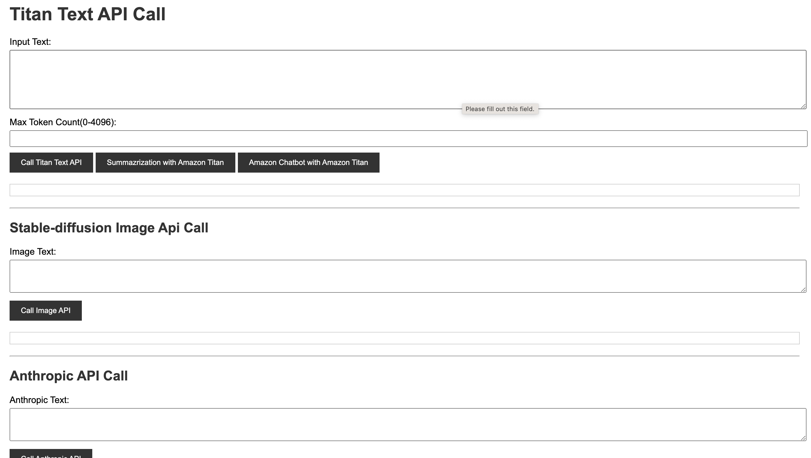
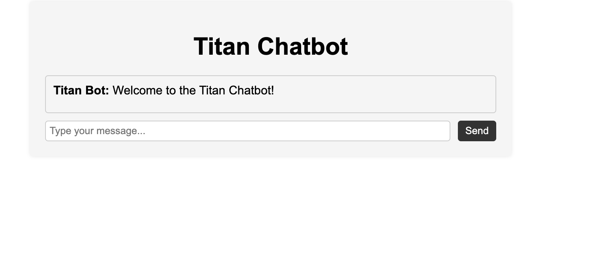

# BedrockDemo
Welcome to the bedrockDemo repository! This guide will assist you in setting up and running the BedRock demo using VS Code.

## Installation 
- Clone this repository into your local development environment using VS Code
- Check the IAM Permission before you proceed ahead 
- Open the terminal in the VS code
- Naviage to the working directory path in the terminal
```/Users/shadhav/Documents/bedrockDemo/flask ``` the path will look like this 
- In this path in the terminal install flask 
```pip install flask```
- Once these steps are completed, you are ready to proceed with the BedRock demo using VS Code. 
- Run this command 
```flask run```
- Verify the deployment by navigating to your server address in
your preferred browser.

```sh
127.0.0.1:5000
```


## IAM Permission
1. From the IAM console, perform the following steps:
2. Select the IAM role associated with your user.
3. Click on "Add Permissions" and choose "Create Inline Policies" from the dropdown list.
4. Create a new inline policy and include the following permissions:
```
{
  "Version": "2012-10-17",
  "Statement": [
    {
      "Effect": "Allow",
      "Action": "bedrock:*",
      "Resource": "*"
    }
  ]
}
```
5. Add the following trust relationships:
```
{
  "Version": "2012-10-17",
  "Statement": [
    {
      "Effect": "Allow",
      "Principal": {
        "Service": "http://bedrock.amazonaws.com"
      },
      "Action": "sts:AssumeRole"
    },
    {
      "Sid": "",
      "Effect": "Allow",
      "Principal": {
        "Service": "http://sagemaker.amazonaws.com"
      },
      "Action": "sts:AssumeRole"
    }
  ]
}
```
# UI of the app 





